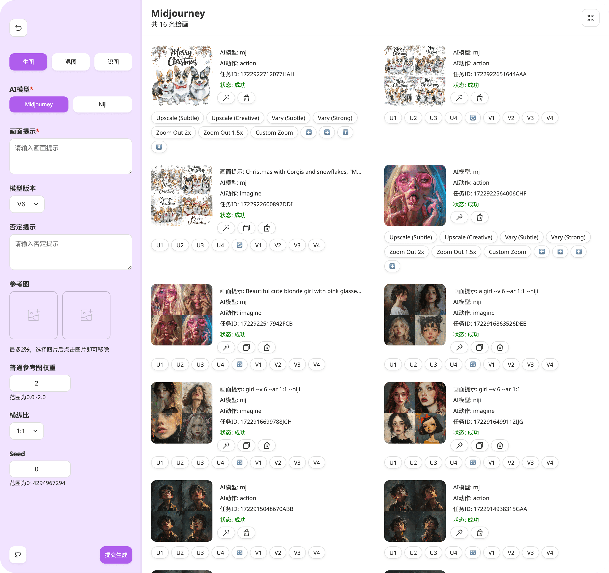
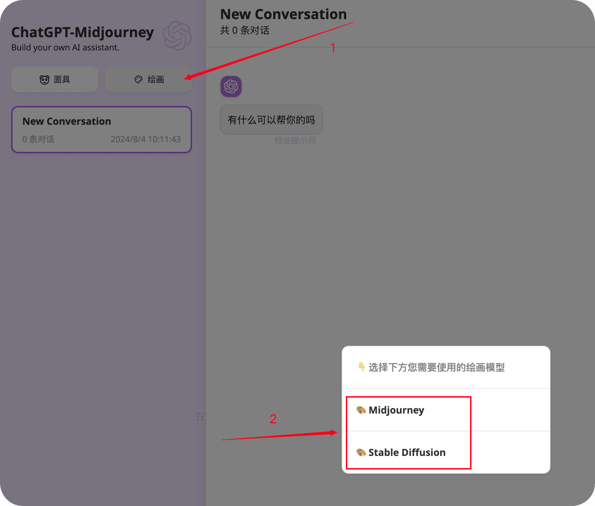
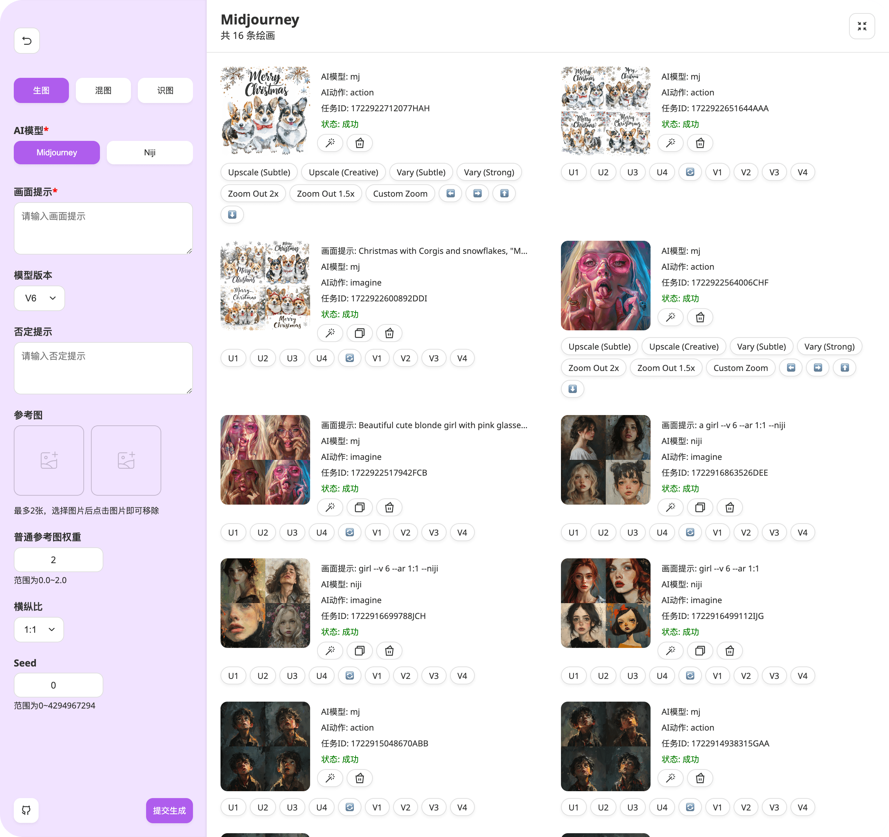
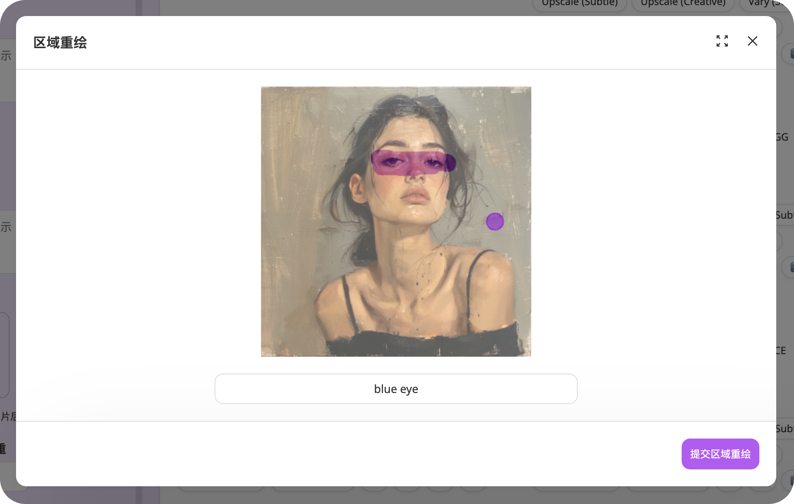
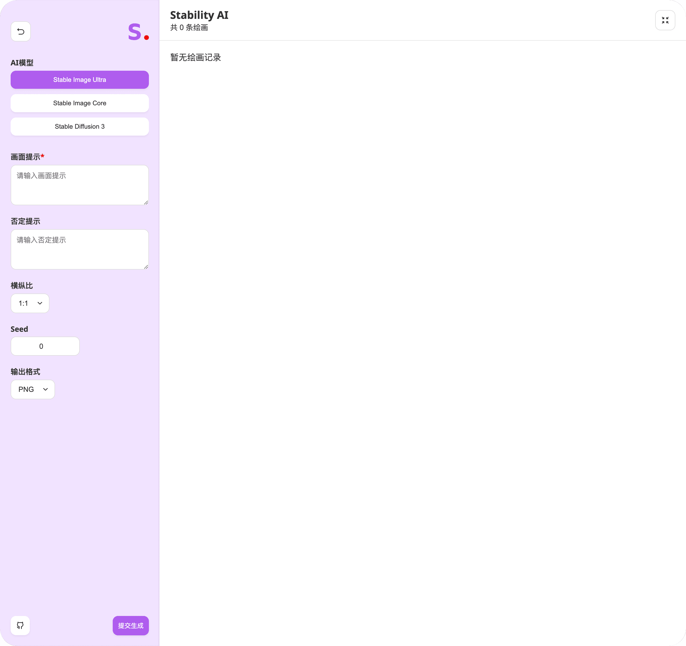
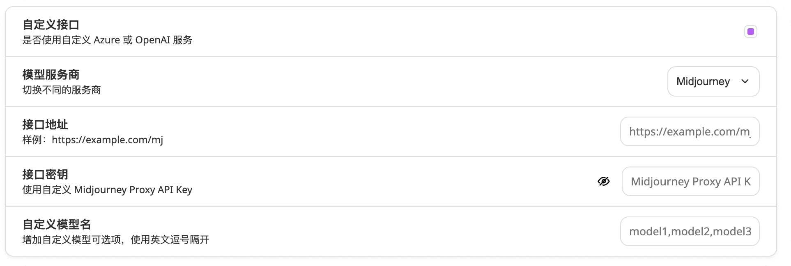

<div align="center">

<h1 align="center">🌻 AhamAI</h1>

English | [中文](./README_EN.md)

Chat with multiple LLMs and API providers - Your AI Assistant

AhamAI - One-click access to your own AI assistant with multiple LLM support

[Community Group](https://github.com/AhamAI/AhamAI/issues/30) | [💥PRO Version](https://github.com/Licoy/GoAmzAI)

[](https://github.com/Licoy/wordpress-theme-puock)



</div>

## Features
> 🍭 PRO Version supports more powerful features:
> - Runs smoothly on servers with as low as 1C1G
> - Ultra-fast visual deployment with BT panel, simple and understandable configuration
> - Fully responsive site supporting PC, tablet, and mobile
> - Low memory usage, native high concurrency support with Golang development
> - Includes multiple AI modules such as AI conversations, AI drawing, AI music, AI video, AI-generated PPT, PDF parsing conversations, AI application support, etc.
> - Has a very complete operation mechanism, including but not limited to package systems, redemption code systems, invitation rewards, check-in benefits, promotion rebates, etc.
> - [🫱 Click here to learn about and experience the PRO version](https://github.com/Licoy/GoAmzAI)

### Supported Features
- [x] All original features
- [x] Multiple LLM API provider support
- [x] Dynamic model fetching from API providers
- [x] AhamAI API integration with OpenAI-compatible endpoint
- [x] StabilityAI
  - [x] Support for Stable Image Ultra
  - [x] Support for Stable Image Core
  - [x] Support for Stable Diffusion 3
- [x] Midjourney `(Unofficial)`
  - [x] Midjourney `Imagine` `Upscale` `Variation` `Zoom` `Vary` `Pan` `Reroll` `Describe` `Blend` and many other operations, perfect support for any operation after Midjourney image generation
  - [x] Midjourney regional redrawing (Vary Region) support
  - [x] Midjourney reference images
  - [x] Drawing progress percentage, real-time image display

## API Configuration
The application is configured to use AhamAI API provider:
- **Endpoint**: `https://ahamai-api.officialprakashkrsingh.workers.dev`
- **Default API Key**: `ahamaibyprakash25`
- **Models**: Dynamically fetched from `/v1/models` endpoint

## MidjourneyAPI Description
> This project's Midjourney-related API interfaces use the following open-source projects or similar projects to provide API generation capability support. Before using this project, you need to self-host this service or use a third-party relay platform's API.

### Open Source Midjourney-Proxy
- Project Address: [trueai-org/midjourney-proxy](https://github.com/trueai-org/midjourney-proxy)

## Parameter Description
### `MJ_PROXY_URL`
MJ Proxy API link address
### `MJ_PROXY_KEY`
MJ Proxy API key
### `CODE`
(Optional) Access password in the settings page
### `...Other parameters`
Consistent with the original project

## Deployment
### Docker
```shell
docker run -d -p 3000:3000 \
   -e OPENAI_API_KEY="ahamaibyprakash25" \
   -e BASE_URL="https://ahamai-api.officialprakashkrsingh.workers.dev" \
   -e MJ_PROXY_URL="" \
   -e MJ_PROXY_KEY="" \
   ahamai/ahamai:latest
```
### Manual Deployment
- Clone this project locally
- Install dependencies
```shell
npm install
npm run build
npm run start // #Or development mode: npm run dev
```
## Usage
### Create Drawing
After deployment, click on the drawing in the upper left, select the drawing model you need to use to enter:

## Screenshots
### Midjourney Generation Main Interface

### Midjourney Regional Redrawing

### StabilityAI Generation Main Interface

### Custom Configuration Interface

### More Features
Discover them yourself

## Open Source License
[MIT](./LICENSE)
